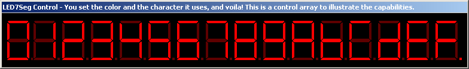



## LED 7 Segment Control

### Description

This 7 segment LED control has a simple code interface for displaying standard 7 segment characters. It's expandable to do anything you want. Just set the dim and bright colors, the character to display and you have it! Please vote, even if you don't like it.
 
### More Info
 

             |
---                |---
**Submitted On**   |2002-07-04 12:55:04
**By**             |[James W\. Manning](https://github.com/Planet-Source-Code/PSCIndex/blob/master/ByAuthor/james-w-manning.md)
**Level**          |Intermediate
**User Rating**    |4.3 (17 globes from 4 users)
**Compatibility**  |VB 6\.0
**Category**       |[Custom Controls/ Forms/  Menus](https://github.com/Planet-Source-Code/PSCIndex/blob/master/ByCategory/custom-controls-forms-menus__1-4.md)
**World**          |[Visual Basic](https://github.com/Planet-Source-Code/PSCIndex/blob/master/ByWorld/visual-basic.md)
**Archive File**   |[LED\_7\_Segm101910742002\.zip](https://github.com/Planet-Source-Code/james-w-manning-led-7-segment-control__1-36565/archive/master.zip)

